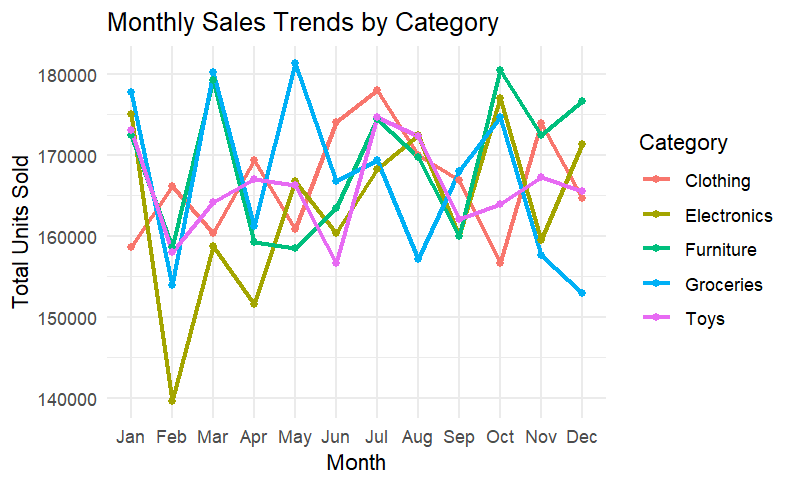
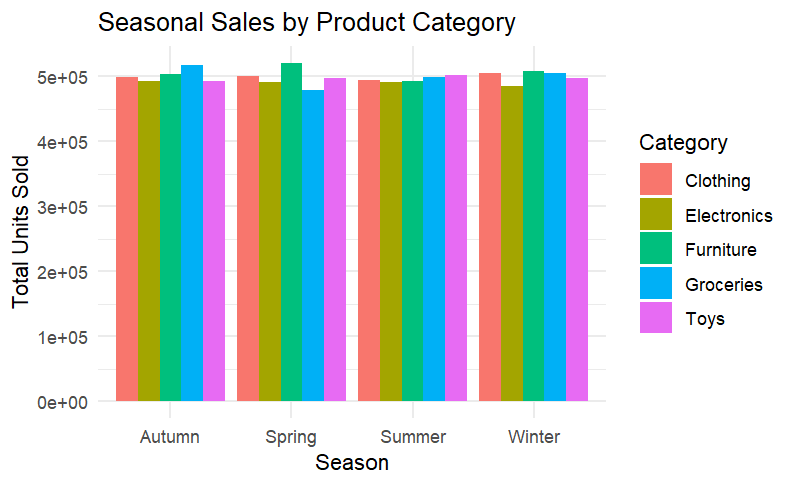
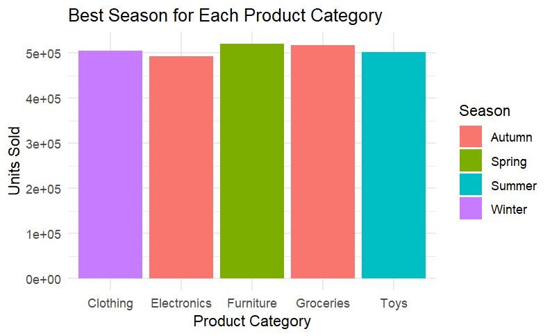

```{r setup, include=FALSE}
knitr::opts_chunk$set(echo = TRUE)
```
## Load Required Packages

```{r}
# Load required packages
library(dplyr)      # for %>%, mutate, case_when
library(ggplot2)    # for visualizations
library(lubridate)  # for dates
library(readxl)     # for reading Excel files
library(writexl)

# Import dataset
data <- read_excel("C:/Users/mouaf/Downloads/archive (8)/retail_store_inventory.xlsx") 

# Prepare dataset: add Date + Month columns
data <- data %>%
  mutate(
    Date  = as.Date(Date),
    Month = month(Date, label = TRUE, abbr = TRUE)
  )

# Preview first rows
head(data) 

# Calculate monthly sales by Category
monthly_sales <- data %>%
  group_by(Category, Month) %>%
  summarise(Total_Sales = sum(`Units Sold`, na.rm = TRUE), .groups = "drop")

print(head(monthly_sales))

# Monthly sales line chart
ggplot(monthly_sales, aes(x = Month, y = Total_Sales, color = Category, group = Category)) +
  geom_line(size = 1) +
  geom_point() +
  labs(title = "Monthly Sales Trends by Category",
       x = "Month",
       y = "Total Units Sold") +
  theme_minimal()

# Save monthly sales to Excel
write_xlsx(monthly_sales, "monthly_sales.xlsx")

#Insights: The monthly sales line chart highlights seasonal demand patterns for each product category across months. This will help to identify peak months where inventory planning and promotions should primarily focused.

# Seasonal sales summary
seasonal_sales <- aggregate(`Units Sold` ~ Category + Seasonality, 
                            data = data, 
                            sum, 
                            na.rm = TRUE)

# Preview the first rows
head(seasonal_sales)

# Bar chart of seasonal sales by category
ggplot(seasonal_sales, aes(x = Seasonality, y = `Units Sold`, fill = Category)) +
  geom_bar(stat = "identity", position = "dodge") +
  labs(title = "Seasonal Sales by Product Category",
       x = "Season",
       y = "Total Units Sold") +
  theme_minimal()

# Save seasonal sales results to Excel
library(writexl)
write_xlsx(seasonal_sales, "seasonal_sales.xlsx")

#Insights: The Seasonal Sales summary chart shows which seasons had contributed the most to sales across the different categories. After analyzing this data, retailers can align seasonal promotions (ex: summer sales for toys, winter sales for clothing) with customer buying behavior.

# Heatmap of monthly sales by category
ggplot(monthly_sales, aes(x = Month, y = Category, fill = Total_Sales)) +
  geom_tile(color = "white") +
  scale_fill_gradient(low = "lightblue", high = "darkblue") +
  labs(title = "Heatmap of Monthly Sales by Category",
       x = "Month",
       y = "Category") +
  theme_minimal()

# Save heatmap data to Excel
write_xlsx(monthly_sales, "heatmap_monthly_sales.xlsx")

#Insights: The monthly sales heatmap offers a more visually appealing overview of high months vs. low month sales for each category. The darker shades represent stronger sales, making it easy to spot peak months at a glance.

# Best season for each product category
best_season <- seasonal_sales %>%
  group_by(Category) %>%
  slice_max(`Units Sold`, n = 1)

# Preview results
print(best_season)

# Bar chart of best season per category
ggplot(best_season, aes(x = Category, y = `Units Sold`, fill = Seasonality)) +
  geom_col() +
  labs(title = "Best Season for Each Product Category",
       x = "Product Category",
       y = "Units Sold",
       fill = "Season") +
  theme_minimal()
# Save best season results to Excel
write_xlsx(best_season, "best_season.xlsx")

#Insights: Here I have identified the single best-performing season per category. Creating this provides a clear view and recomendation for when to prioritize stock levels and any targeted campaigns.

```
 
 ## Conclusion & Recommendations

# A Summary of my Findings:  
- Monthly Sales:Sales trends can vary significantly across months, with peaks for certain product categories.  

- Seasonal Sales:Each product category shows stronger performance in specific seasons (for example: clothing in Winter, toys in Summer). 

- Best Season: Every category has one dominant season emphasizing their best at something, making it easier to align promotions and stock planning.

- Heatmap: A comparison confirms seasonal trends and highlights visually the months with the highest activity.  

#Recommendations for future Business decisions: 
1. Seasonal Promotions: Align your seasonal marketing campaigns with each category’s peak season (for ex: run targeted promotions for Clothing in Winter and Toys in Summer).

2. Inventory Planning: To prevent any inventory shortages for peak months, stock more aggressively in the months prior.  

3. Category Prioritization: Try to focus on the most high-performing categories during their strongest months to maximize sales revenue.  

4. Data-Driven Decisions: Actively monitor trends using monthly and seasonal breakdowns of best and worst months in terms or revenue and strategy used to adjust year over year.  


#By combining these recommendations, retailers can optimize their  marketing efforts as well as improve their supply chain efficiency while increasing profitability through a data-driven approach.

## 📊 Download Project Data & Visualizations

You can view or download the data outputs used in this project below:

- [Seasonal Sales (Excel)](seasonal_sales_summary_table.xlsx)
- [Monthly Sales (Excel)](monthly_sales_summary_table.xlsx)
- [Best Season by Category (Excel)](best_season_summary_table.xlsx)
- [Heatmap Monthly Sales (Excel)](heatmap_monthly_sales.xlsx)
 
 #View Key Visualizations
  #Monthly Sales Line Chart


This chart highlights seasonal demand patterns for each product category across months. It helps identify peak months where inventory planning and promotions should focus.

### Seasonal Sales Bar Chart


Shows which seasons contribute the most to sales across categories. Retailers can align seasonal promotions with customer buying behavior.

### Best Season by Category


Identifies the single best-performing season per category, useful for stock prioritization and targeted campaigns.

### Monthly Sales Heatmap


The darker shades represent stronger sales, making it easy to spot peak months at a glance.


